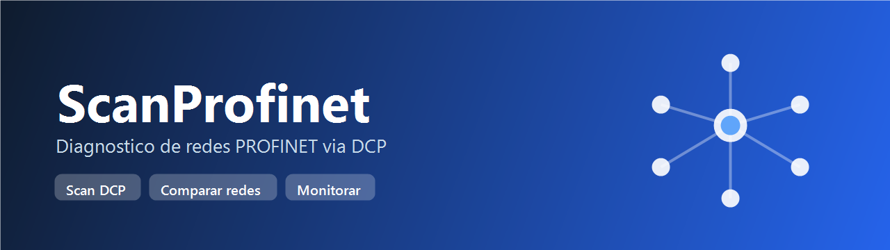
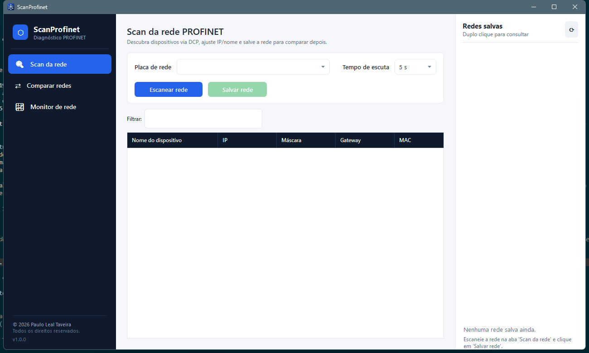

<p align="center">
  
</p>

<h1 align="center">ScanProfinet</h1>

<p align="center">
  Ferramenta de <b>diagnóstico de redes PROFINET</b> para uso em campo — descobre dispositivos via DCP,
  salva e compara configurações de rede e monitora a disponibilidade dos equipamentos em tempo real.
</p>

<p align="center">
  
  
  
  
</p>

<p align="center">
  <a href="https://github.com/paulinholt/ScanProfinet/releases/latest"><b>⬇️ Baixar o instalador (Release mais recente)</b></a>
</p>

---

## 📌 O que é

O **ScanProfinet** é um aplicativo desktop para Windows que ajuda técnicos e engenheiros de automação a
**enxergar e conferir a rede PROFINET** de uma máquina ou planta. Ele conversa direto com os dispositivos
pela camada 2 (protocolo **DCP**, o mesmo usado pelas ferramentas dos fabricantes) e adiciona uma camada
de **inteligência**: salvar a foto da rede, comparar com uma nova varredura e monitorar quedas.

É **offline**, roda com um clique e não depende de nuvem, servidor ou licença.

<p align="center">
  
</p>

---

## ✨ Funcionalidades

### 🔍 Scan da rede (DCP)
- Descobre todos os dispositivos PROFINET na placa de rede selecionada.
- Mostra **nome, IP, máscara, gateway, MAC, fabricante e função** de cada um.
- **Atribui IP / máscara / gateway** a um dispositivo.
- **Atribui o Device Name** (padronizado em minúsculas, conforme a norma).
- **Pisca o LED** do equipamento para localizá-lo fisicamente no painel.
- **Salva a rede** com um nome (ex.: `RedeCliente1`) para comparar depois.
- Otimizado para **redes grandes** (centenas de dispositivos): espalha e reenvia a descoberta para não perder nós.

### ⇄ Comparar redes
- Escolhe uma **rede salva** como referência e escaneia a **rede atual**.
- Compara pela identidade física (**MAC**) e aponta, com destaque colorido:
  - 🔴 **SAIU DA REDE** — dispositivo que não responde mais (ex.: um inversor caiu).
  - 🟠 **ENTROU NA REDE** — dispositivo novo que não constava da referência (alguém plugou algo).
  - 🔵 **ALTERADO** — mudou IP, nome, gateway ou máscara (mostra o *antes → depois*).
- Ideal para auditar se a instalação continua igual ao comissionamento.

### 📈 Monitor de rede
- Faz **ping contínuo** dos dispositivos (de um scan ou de uma rede salva).
- Estado ao vivo: **ONLINE / OFFLINE / OSCILANDO**, latência, perda e histórico.
- **Detecção de novos dispositivos**: re-scan DCP periódico avisa quando algo é plugado na rede.
- **Notificações** na bandeja do Windows e dentro do app para **quedas** e **novos dispositivos**.
- Registra tudo em **log e banco**: quedas, retornos, oscilações (*flapping*) e adições.
- Limite configurável de dispositivos monitorados (padrão **50**).

### 🔗 Topologia (LLDP)
- **Mapa de vizinhança** porta a porta, lido via **SNMP** (LLDP-MIB) de cada dispositivo.
- **Desenho gráfico** da rede (nós + cabos) com layout automático, zoom e nós arrastáveis.
- **Salvar e comparar** topologias → detecta **cabo trocado**, ligação que sumiu ou nova.
- Comunidade SNMP configurável.

### 🖥️ Outros
- **Exportar para Excel (.xlsx)** — scan, comparação e topologia, com colunas prontas para filtrar.
- **Ícone na bandeja**: minimizar/fechar mantém o monitoramento rodando em segundo plano.
- **Painel lateral de redes salvas**: duplo clique consulta o que foi mapeado e a data.
- **Logs dedicados** de reendereçamentos (Set IP/Nome) e de eventos de monitoramento.

---

## 🚀 Instalação (para usuários)

> Requer **Windows 10/11** ou **Windows Server 2012 ou superior** (64 bits) e permissão de **Administrador**.

1. Baixe o instalador na **[página de Releases](https://github.com/paulinholt/ScanProfinet/releases/latest)**
   (arquivo `ScanProfinet-Setup-x.y.z.exe`).
2. Execute **como Administrador** (clique direito → *Executar como administrador*).
3. Avance no assistente. O instalador já traz e instala automaticamente, quando necessário:
   - **Npcap** — driver para o scan PROFINET/DCP;
   - **Visual C++ 2015‑2022** — runtime exigido pelo aplicativo.
4. Ao concluir, use o **atalho na área de trabalho** para abrir.

> 💡 O aplicativo é *self-contained*: **não** é preciso instalar o .NET separadamente.

### ✅ Pré-requisitos de campo
- Use a **placa Ethernet cabeada** ligada à rede PROFINET. Wi‑Fi **não** funciona para DCP.
- Se aparecer o aviso de Npcap, aceite a instalação (o monitor por ping funciona mesmo sem ele).

---

## 📖 Como usar

| Passo | Ação |
|------:|------|
| 1 | Em **Scan da rede**, escolha a **placa de rede** e clique em **Escanear rede**. Em redes grandes, use *Tempo de escuta* de 8–12 s. |
| 2 | Selecione um dispositivo para **atribuir IP / nome** ou **piscar o LED**. |
| 3 | Clique em **Salvar rede** e dê um nome (ex.: `RedeCliente1`). Ela aparece no painel à direita. |
| 4 | Em **Comparar redes**, escolha a rede salva, clique em **Escanear rede atual** e depois em **Comparar**. |
| 5 | Em **Monitor de rede**, escolha a fonte, **Selecione 50** dispositivos e clique em **Iniciar**. Ative *Detectar novos* para ser avisado quando algo entrar na rede. |

---

## 🗂️ Onde ficam os dados

Tudo fica em `%LOCALAPPDATA%\ScanProfinet` (não requer internet nem licença de banco):

| Arquivo/pasta | Conteúdo |
|---|---|
| `scanprofinet.db` | Banco **SQLite**: redes salvas e histórico de eventos. |
| `logs\reenderecamentos-AAAA-MM.log` | Cada Set IP / Set Nome (antes → depois). |
| `logs\monitoramento-AAAA-MM.log` | Quedas, retornos, oscilações e adições. |
| `logs\scanprofinet-AAAA-MM-DD.log` | Log geral de diagnóstico. |

---

## 🛠️ Compilar a partir do código (para desenvolvedores)

```bash
# Requisitos: .NET 8 SDK
cd ScanProfinet
dotnet run
```

**Gerar o instalador** (requer [Inno Setup 6](https://jrsoftware.org/isdl.php)):

```powershell
# Opcional: coloque npcap-*.exe e vc_redist.x64.exe em installer\dependencies\
cd installer
powershell -ExecutionPolicy Bypass -File build-installer.ps1 -Version 1.1.2
```

### Tecnologias
- **WPF (.NET 8)** — interface desktop, padrão MVVM (CommunityToolkit.Mvvm)
- **SharpPcap / PacketDotNet** — protocolo DCP em camada 2
- **Microsoft.Data.Sqlite** — banco local
- **Inno Setup** — instalador; **Npcap** — captura de pacotes

---

## 📄 Licença

Distribuído sob a licença **[MIT](LICENSE)**. Copyright © 2026 **Paulo Leal Taveira**.

## 👤 Autor

**Paulo Leal Taveira** — desenvolvimento e concepção.

> Contribuições, sugestões e *issues* são bem-vindos.
